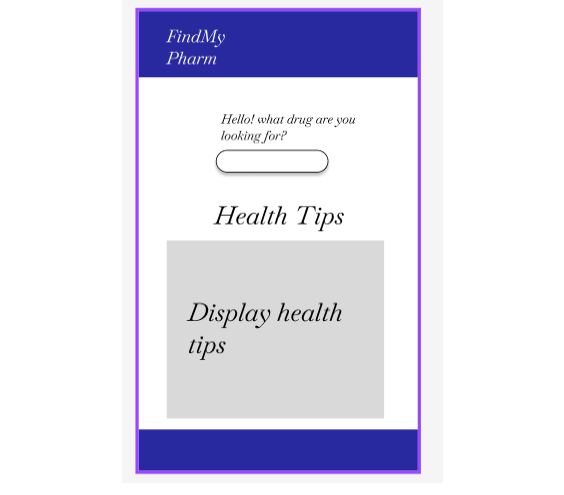
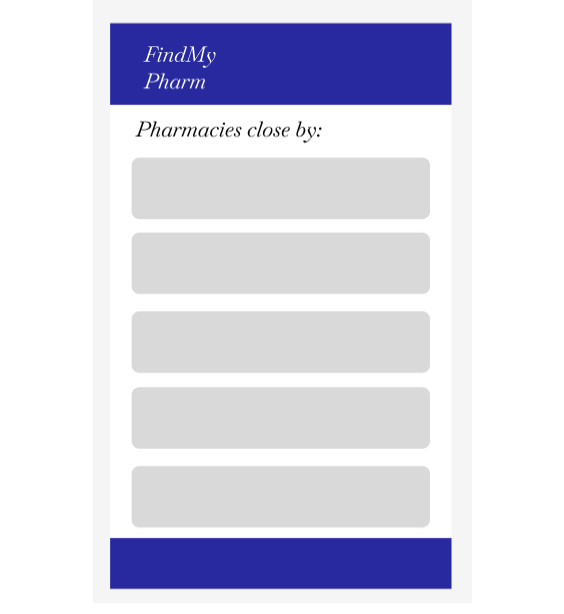
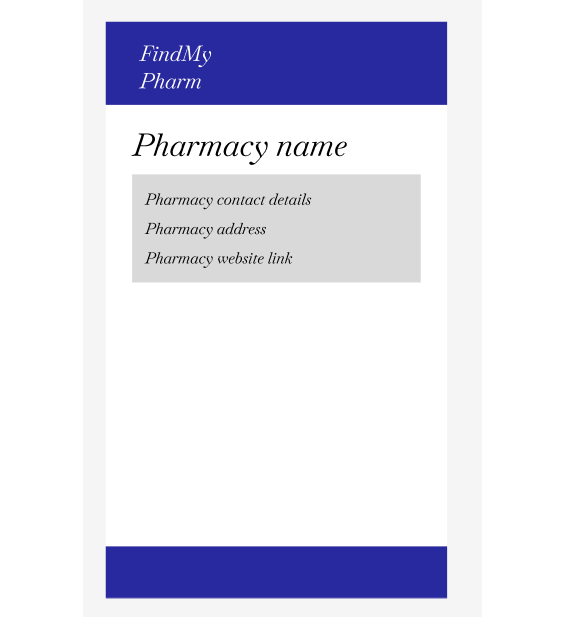

# Project Title

## Overview

FindMyPharm is an application built to help users locate their desired drugs and the pharmacies with those available drugs that are within their vicinity, by providing information on the pharmacy including contact details it eliminates the stress that comes from dealing with the unavailability of a drug as well as bridges the gap between the user and their favourite pharmacies

### Problem Space

Most pharmacies always have the drugs which are in high demand available and so sometimes fail to make provision for drugs which are not in demand which is mostly undestandable from an economical standpoint but when a user is in need of a drug which is not often in demand and cannot purchase the drug or rather has no idea on where to go about looking for the drug, the urgency presents itself where the user needs a drug and is at loss on how to find it.
FindMyPharm aims to eliminate that problem and bridge the gap between the user and the pharmacies with the drugs readily available by providing the user with a find one find all application that generates a list of pharmacies with said drugs and the pharmacies contact details as well as route to closest pharmacies and the ability to rate pharmacies based on interactions with the pharmacies

### User Profile

- Everyone :
  - But wil mostly focus on those who are too busy to look or drugs from stop to stop such as the middle-aged
  - As well as those who do not have a stable source of transportation to have an idea of where to go.

### Features

- List of pharamacies according to the user current location
- Contact details of pharmacies to confirm availability
- Google map to sow location of pharmacy with respect to user

## Implementation

### Tech Stack

FrontEnd:

- React
  Libraries:
- sass
- axios
- react
- react router dom

BackEnd:
Node Javascript
Libraries:

- knex
  Framework:
- express
  Database:
- Mysql

### APIs

- Google maps api

### Sitemap

- Homepage - with search bar that will display drop down of list of drugs suggestions based on user input
- Pharmacies page - List of pharmacies that have the requested drug
- Single pharmacy page having details of the pharmacy like adress and contact details as well as opening and closing time.

### Mockups

#### Home Page

#### Pharmacy List Page

#### Single Pharmacy Page

### Data

There will be four tables in a single database

Drugs table : primary key : drugId

Pharmacy table: primary key : pharmId

Pharmacy drugs table: foreign key : drugId, pharmId ; relationship: many to many

Health tips: no relationship

### Endpoints

**Get/drugs**

- Get a list of suggestions for drugs inputed by user

sample: user request : naproxen

Response:
drugs:

{
drugId: 100
name: Naproxen PM
}
{
drugId: 200
name: Naproxen ER
}
{
drugId: 300
name: Naproxen DR
}
{
drugId: 400
name: Naproxen sodium
}

**Get/ Health-tips**

- Get a few health tips quotes and display them

**Get/pharmacies/:drugId**

- Get a list of pharmacies with the selected drug by the user using the drug id and user location as a sort or filter method making use of google maps api and havesine function

sample: Get /pharmacies?drugId=1

**Get/pharmacies/:pharmId**

- Get the details of the pharmacy selected by the pharmId such as contact details like phone number and email as well as address

sample: Get /pharmacies?pharmId=1

**Post/pharmacies/:pharmId/rate**

- Post the rating of a particular pharmacy, 1-5 star rating and the amount of reviews  based on the number of times the pharmacy was rated will be stored in each pharmacy backend

## Roadmap

- Initialize the project with a clear folder structure.
- Create client (react project with routes and components)
- Create server (Set up Node.js and Express for the backend server.)
- Create migrations
- Write sample data for testing

**BACKEND**

- implement GET request to get suggested list of all the drugs
- implement GET request to get health tips
- implement GET request to get list of pharmacies close to user with drug available
- implement GET request to get pharmacies details by id of pharmacy selected
- implement POST request to post ratings and ratings count of pharmacies to backend

**FRONTEND**

- Set usestates, use effect and use navigate functions
- build home page and populate data for suggested drugs list and health tips
- build pharmacy list page and populate data for pharmacies close by
- build single pharmacy page with data populated using pharmacy id

- Bug fixes

- DEMO DAY

---

## Installation Notes
- This web application is for mobile view, as a future implementation a tablet and desktop breakpoint will be added.

## Future Implementations

- user login and authentication page
- Favourite pharmacies
- discount for drugs
- access to healthcare professionals or set family doctor emergency line
- reminder for drug consumption schedule.
- build another page for admins that would have smaller pharmacies use the application to keep records of their medications so at the end of the day it uploads the available medicatons to the findmypharm server backend

